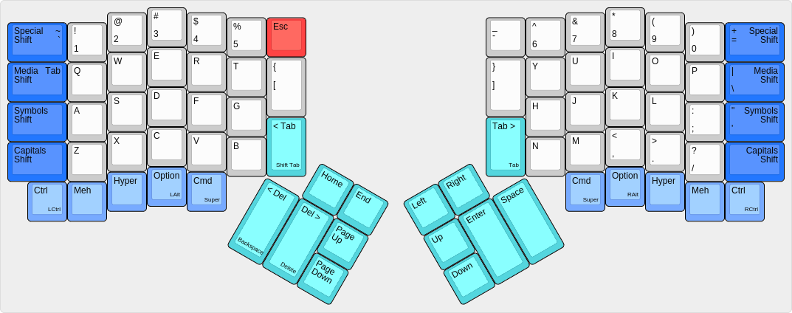
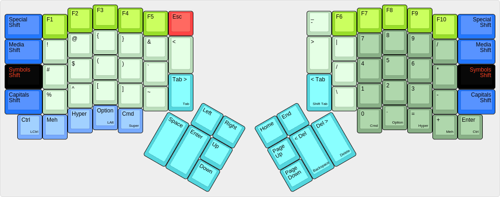
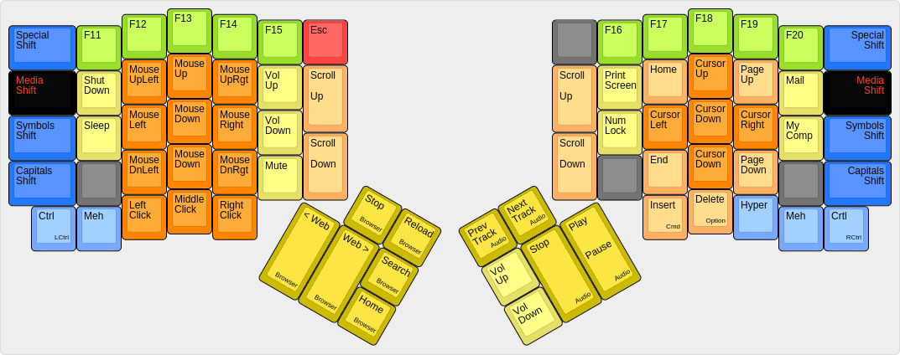

# The Ordinary Layout, a familiar and powerful layout #

The Ordinary Layout is intended to be unremarkably mundane and remarkably useful. This layout maintains most key positions from common QWERTY keyboards, and it features enhanced Symbol and Media layers compared to the default Ergodox EZ layout.

The Ordinary Layout is supposed to look mostly like a normal keyboard, except in the ways that the Ergodox key arrangement is unique. The thumbs are responsible for space, enter, plus both forward and backward delete; with only a couple exceptions, all other keys are in the same place they are found on traditional keyboards.

Nicholas Keene
ordinarylayout@nicholaskeene.com
no rights reserved, use for any purposes, credit me if you are a nice person

## The Base Layout ##

* The yellow keys are text navigation and manipulation
* The dark blue keys are shift keys: case shift (traditional shift), symbol shift, and media shift
* The light blue keys are modifiers: traditional Control, Option, and C	ommand keys, plus Hyper and Meh
* The two green keys, tab and tilde, are in the typical places to ease use of the Application Switcher
* The red keys is Escape, one of the few buttons which is in an atypical position

This layout puts the modifier keys along the bottom of the keyboard where they are on most layouts. They are in the regular order, with the addition of Hyper and Meh keys. The shift key (case shift) is in the prevalent location. The primo slots usually wasted on Caps Lock and Enter are instead used for the Symbol Shift key which promotes use of the Symbols layer. On the right side of the layout, the Symbol and Media shift keys also double as character keys -- quote and backslash, respectively -- so that touch typists can continue to find those punctuation marks in the right place.

Other than the yellow keys, the only buttons which move to new locations are the Brackets and Dash and Escape. Most touch typists dont touch-type brackets or dash anyway, so only Escape really requires retraining of muscle memory.

The four big yellow keys are arranged differently than in the default Ergodox EZ layout. The Ordinary Layout here copies the design of the old Fingerworks TouchStream keyboard, but also reflects the natural presumptions of the author -- me!; I type the space character with my right hand, and to me it makes sense for the two delete keys to be next to one another.

The Forward Tab and Backward Tab keys are there mostly because I ended up with two extra buttons and needed something to do with them. My muscle memory from using the Truly Ergonomic Keyboard makes me look for the Tab key with my right index finger, so it is handy to have this redundant Tab, and the idea with the Backward Tab key is that it becomes easy to navigate text fields in forms, or to indent/unindent code.

## The Symbols Layout ##

* The periwinkle keys are the eponymous symbols
* The gray keys are F-Keys
* The green keys are a proper number pad
* The red Escape key is found in the "right" location on this layer
* The yellow keys are the *reverse* of the yellow keys on the base layer
* The dark blue Media key means that the Media layer is accessible with the left hand

The Ergodox EZ ships with the "Coder Layer" which I like to call the Symbols layer. There are some significant improvements in The Ordinary Layout over the default layout.

The symbol keys are mostly the same as on the default layout, which did a good job in this regard, but with a few enhancements:
* Angle brackets on this layer mean that curly, square, and angle brackets are all available on different layers of the same two buttons. Also, they mean that all kinds of brackets, including parentheses, are available on both the Base and Symbols layers.
* The slash, backslash, and pipe characters are grouped together as a memory aid.
* The & and | symbols are juxtaposed as a memory aid

The number pad area here, in green, includes all four arithmetic operations in the same order found on most number pads. This layout also has an Enter key, and importantly the key codes emitted by this number pad are *number pad specific key codes*, not regular keyboard key codes. Some software distinguishes keypad codes so users now have access to a fully realized number pad when using The Ordinary Layout.

The Escape key's true home is in the top left corner of the keyboard, so on this layer it can be found there. And on the Symbols layer, the Tab key switches to become a Media key, so press Symbols then Media to access the Media layer using the left hand.

Finally, consider the yellow text-nav keys. In the Symbols layer, these are *reversed* from the base layer, with most keys mirrored, but the Delete keys shifted to maintain the directional significance of their arrangement. This is powerful! Often I find myself using the mouse with my right hand, and the left hand needs to press Enter. Instead of reaching the left hand over to the right side of the keyboard, now I simply tap Symbols to reverse the yellow keys, and Enter is right where it should be.

## The Media Layout ##

* The light turquoise keys move the mouse or the text cursor
* The dark turquoise keys scroll
* The light purple keys signal Web and Audio applications
* The dark purple keys signal the operating system
* The red Escape key is, again, found in the "right" location

This layer was inspired by the Media layer on the Ergodox EZ but takes it farther. The Fingerworks TouchStream had a very useful feature for controlling the text cursor easily and this layer does something similar. The left hand can move the mouse, the right hand moves the text cursor, in all four directions, in small or large increments. This greatly enhances navigation in text documents.
